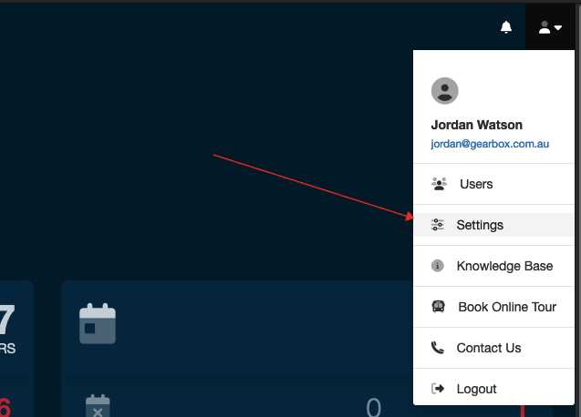
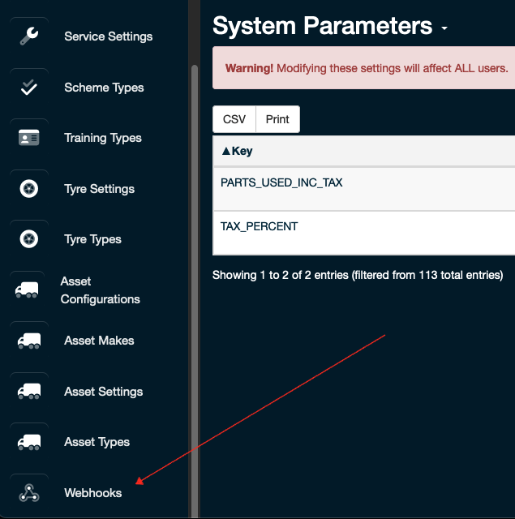
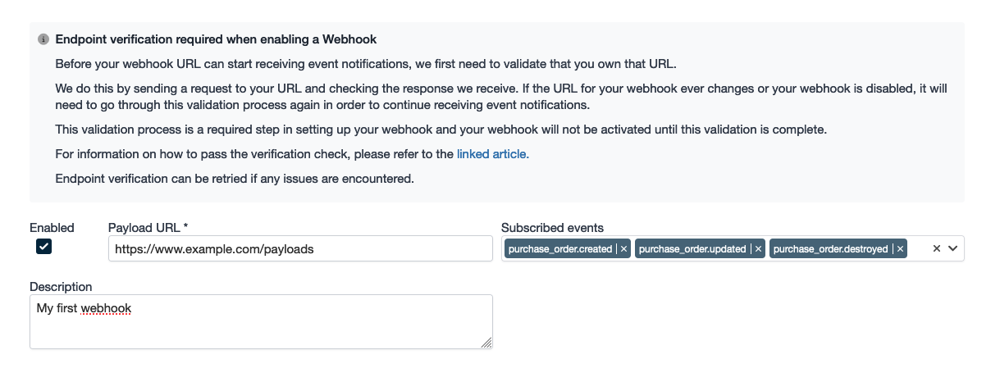
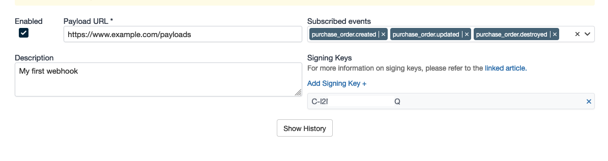
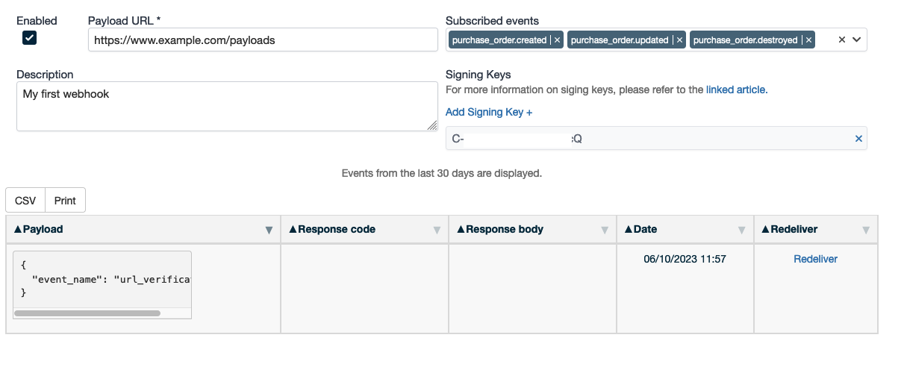

# Gearbox Webhooks

Gearbox provides a variety of webhooks for applications to consume. To get started, you must first setup and verify an endpoint

## Restrictions

 - After 10 failed attempts to deliver to an endpoint, the webhook will be disabled until a manual redeliver has succeeded
 - Only HTTPS endpoints are supported, non-encrypted endpoints are not supported
 - You must [verify the endpoint](verification.md) you wish to receive events at before events will be delivered

## Setup

### Requirements

- [ ] Gearbox account with administration privileges

----

1. Navigate to 'Settings' -> 'Webhooks':

2. Click 'Add New Webhook'

3. Enter the required details and select the events you wish to subscribe to:

Note: you do not need multiple entries for the one endpoint, simply subscribe to the events you want that endpoint to receive.

4. Upon saving we will attempt to verify that the endpoint is owned by you. You can find more information about validating an endpoint and [verifying a request came from Gearbox here](verification.md)

5. Once the endpoint has been validated you will receive events to the endpoint specified whenever one of the events is triggered.

6. You can view webhook events that have been sent by clicking 'Show History' 

## Events

- [Inspections](events/inspections.md)
- [Parts](events/parts.md)
- [Prestarts](events/prestarts.md)
- [Purchase Orders](events/purchase_orders.md)
- [Repairs](events/repairs.md)
- [Services](events/services.md)
- [Tyres](events/tyres.md)
- [Vehicle Status](events/vehicle_status.md)