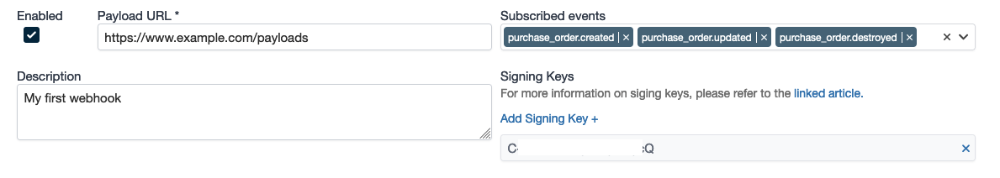

# Webhook Verification

## Requirements

- [ ] Gearbox account with administration privileges

Note: all code samples use Ruby

## Webhook event

A webhook event will contain the following header information:

```rb
request['Content-Type'] = 'application/json'
request['Accept'] = 'application/json'
request['X-Gearbox-Signature'] = 'signature' # this is the computed signature of the timestamp and payload
request['X-Gearbox-Event'] = 'purchase_order.created' # this is the name of the event triggering the webhook
request['X-Gearbox-Request-Timestamp'] = timestamp
request['X-Gearbox-Version'] = 1
request['User-Agent'] = 'Gearbox'
```

## Signing Keys

Signing Keys
Before sending events, Gearbox needs to verify that you own the endpoint that will receive events. Gearbox uses signing secrets to secure these webhook connections.

Each webhook can have a maximum of three (3) signing keys (to facilitate key rotation), these can be access by viewing the edit page of a webhook:



## Verifying a request with signing keys

- Find your signing key(s) in your webhook, in this example we will use `C-l2N7fVHr9gl4OgJfugcQ` as our signing key
- When receiving a request from Gearbox, retrieve the `X-Gearbox-Signature` and `X-Gearbox-Request-Timestamp` in the header of the request
- Check if the `X-Gearbox-Request-Timestamp` differs from the current time by more than 5 minutes (recommended but you may use a longer time if required) to protect your application from replay attack

```rb
timestamp = DateTime.parse(request.headers['X-Gearbox-Request-Timestamp'])
raise StandardError, 'Timestamp is invalid, possible replay attack?' unless timestamp.to_i > 5.minutes.ago.to_i
```

 - Concatenate the timestamp and the body of the request with a colon (`:`) to obtain the basestring

```rb
basestring = "#{request.headers['X-Gearbox-Request-Timestamp']}:#{JSON.parse(request.body.read)}"
```
 - Compare the computed signature with the one in "X-Gearbox-Signature"

```rb
secret_key = "C-l2N7fVHr9gl4OgJfugcQ"
signature = "sha256=#{OpenSSL::HMAC.hexdigest(OpenSSL::Digest.new('sha256'), secret_key, payload)}"
```

## Verifying your endpoint

Follow the steps from [Verifying a request with signing keys](#verifying-a-request-with-signing-keys) and respond with one of the signatures provided in the headers of the request in the following format:

```rb
render json: {
  challenge: request.headers['X-Gearbox-Signature']
}, status: :ok
```

Full example:
```rb
class WebhookController < ApplicationController
  def new
    if request.headers['X-Gearbox-Event'] == 'url_verification'
      render json: {
        challenge: request.headers['X-Gearbox-Signature']
      }, status: :ok
    else
      verify_signature('C-l2N7fVHr9gl4OgJfugcQ')
      head :no_content
    end
  end

  private

  def verify_signature(secret_key)
    payload = "#{request.headers['X-Gearbox-Request-Timestamp']}:#{JSON.parse(request.body.read)}"
    signature = "sha256=#{OpenSSL::HMAC.hexdigest(OpenSSL::Digest.new('sha256'), secret_key, payload)}"
    raise 'Signature did not match!' unless Rack::Utils.secure_compare(signature, request.headers['X-Gearbox-Signature'])
  end
end
```


If you have configured multiple signing keys for your webhook then Gearbox will sign the request with each key and provide the signatures as a comma-separated string in "X-Gearbox-Signature"

Full example code of validating with multiple signatures:
```rb
class PayloadController < ApplicationController
  before_action :validate_timestamp!, only: :new
  before_action :validate_signature!, only: :new

  def new
    formatted_request = JSON.parse(request.body.read)
    if formatted_request['event_name'] == 'url_verification'
      render json: { challenge: request.headers['X-Gearbox-Signature'].split(',').first }, status: :ok
    else
      # process webhook event
      render json: :ok
    end
  end

  private

  def validate_timestamp!
    timestamp = DateTime.parse(request.headers['X-Gearbox-Request-Timestamp'])
    raise StandardError, 'Timestamp is invalid, possible replay attack?' unless timestamp.to_i > 5.minutes.ago.to_i
  end

  def validate_signature!
    received_signatures = request.headers['X-Gearbox-Signature'].split(',')
    timestamp = request.headers['X-Gearbox-Request-Timestamp']

    formatted_request = JSON.parse(request.body.read)

    signature = 'sha256=' + OpenSSL::HMAC.hexdigest(OpenSSL::Digest.new('sha256'), 'C-l2N7fVHr9gl4OgJfugcQ', "#{timestamp}:#{formatted_request}")

    received_signatures.each do |received_signature|
      return true if Rack::Utils.secure_compare(signature, received_signature)
    end
    raise StandardError, 'Signature is invalid'
  end
end
```